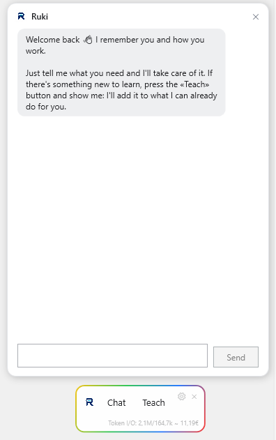
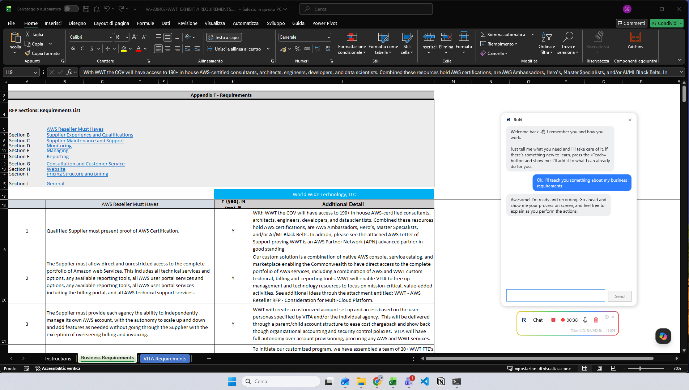
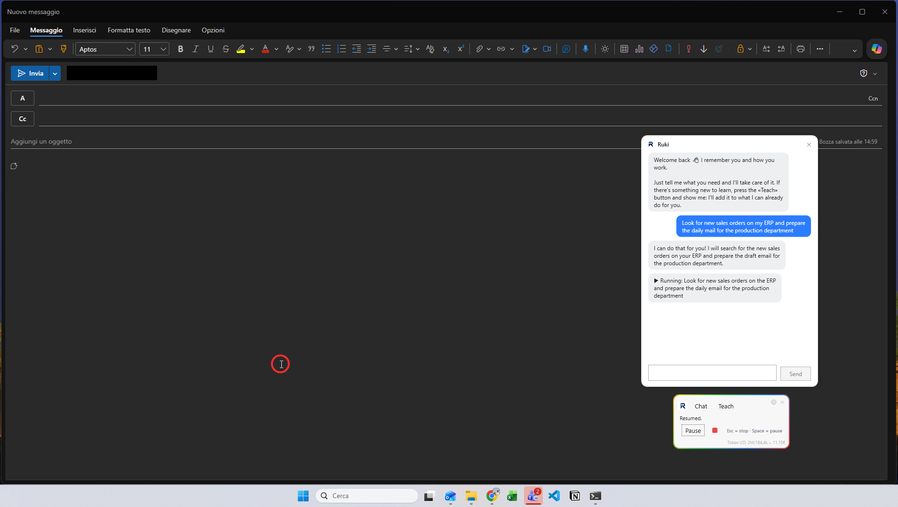

<div align="center">
  
  <h1>Ruki</h1>
  <p>A minimal Windows desktop AI assistant you can <b>teach</b> — and that then does the work for you, under your supervision.</p>
  
</div>

---

Ruki lives as a small floating overlay. You can:

- **Chat** with it in natural language;
- **Teach** it a task by pressing *Teach* and simply demonstrating it (it records screen, audio and your actions);
- have it **execute** tasks for you by driving the mouse and keyboard, while you watch and can pause/stop at any time.

It remembers what it learns in a tree-structured memory, and everything runs on **Google Gemini** using **your own API key**.

## Screenshots

# Learn what you teach from Video and Audio Recording Right alongside your apps 
<div align="center"></div>

# Runs the task for you using your PC
<div align="center"></div>

## Highlights

- **Local-first & private.** There are no Ruki servers; your data stays on your PC and is only sent to Google Gemini (with your key). Password fields are masked during recording. See the [privacy policy](src/Ruki.App/Assets/privacy_en.txt).
- **Italian & English** interface (switchable in Settings).
- **Self-contained installer** — the end user installs only Ruki (no separate .NET install).

## Requirements

- Windows 10/11 (x64)
- A **Google Gemini API key** (free tier available; usage is pay-as-you-go) — Ruki guides you to add it on first run.

## Install

Download the latest `Ruki-Setup-x.y.z.exe` from the [Releases](https://github.com/salvatoregiardina88/ruki/releases) and run it (per-user install, no admin required).

## Build from source

Prerequisites: **.NET 10 SDK**.

```pwsh
dotnet build           # build everything
dotnet test            # run the tests
pwsh build/publish.ps1 # produce the self-contained Ruki.App.exe
```

To build the installer (optional), see [`build/README.md`](build/README.md) (needs Inno Setup).

## License

Ruki is **free for noncommercial use** under the
[PolyForm Noncommercial License 1.0.0](LICENSE).

**Commercial use** (including use by or within a company, or for business
purposes) requires a separate commercial license — see
[COMMERCIAL-LICENSE.md](COMMERCIAL-LICENSE.md).

Copyright © 2026 Salvatore Giardina.
